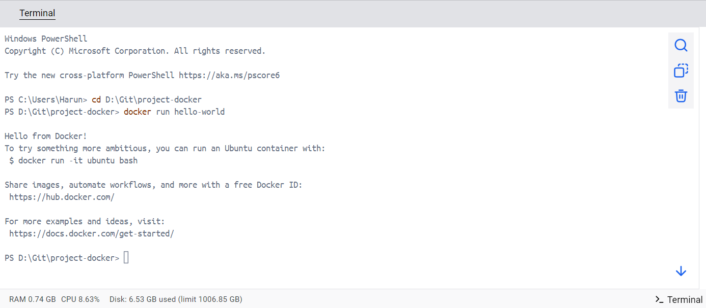
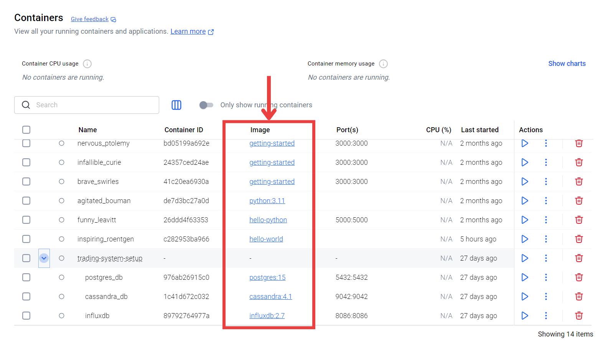

# Docker Setup for DevOps Beginners
---

## Introduction

In modern software development, applications need to be **portable, scalable, and reliable** across different environments.
This is where **Docker** comes in. Docker has become one of the most important tools in the **DevOps ecosystem**, making it possible to package applications into standardized **containers** that run anywhere.

---

## What is Docker?

Docker is an **open-source platform** designed to simplify the process of building, shipping, and running applications.

Think of Docker as a **shipping container system** for software:

* You can put your application + dependencies inside a container.
* That container will run identically on any machine (developer laptop, testing server, production server, or cloud).

**In short**: Docker eliminates the “it works on my machine” problem.

---

## Why Do We Use Docker?

Docker solves many challenges in software development and deployment:

1. **Portability** – Run the same containerized app on Windows, Mac, or Linux.
2. **Consistency** – No dependency conflicts; every developer/tester gets the same environment.
3. **Speed** – Containers start in seconds (faster than virtual machines).
4. **Isolation** – Each container runs independently, preventing conflicts between apps.
5. **Resource Efficiency** – Multiple containers can run on a single machine with minimal overhead.
6. **Scalability** – Easily scale applications up or down by adding/removing containers.
7. **DevOps Friendly** – Works seamlessly with CI/CD pipelines, cloud platforms, and Kubernetes.

---

## Installing Docker

1. Download **Docker Desktop** from [docker.com](https://www.docker.com/products/docker-desktop).

2. Install the application.

3. Open a terminal and type:

   ```bash
   docker --version
   ```

   If it shows a version number, Docker is installed successfully.

4. Run your first test:

   ```bash
   docker run hello-world
   ```

   You will see this message



## What is a Container?

A **container** is a **lightweight, isolated environment** where an application runs with everything it needs (code, libraries, runtime).  
This makes the application **portable, consistent, and easy to run** on any system.

---

#### Simple Analogy
Think of a **container as a lunchbox **:  
It contains the **entire meal (application + dependencies)** so you can take it anywhere and eat it without needing a full kitchen.  
No matter where you go, the food (application) remains the same.

---

#### Difference Between Virtual Machines and Containers

| Feature           | Virtual Machine (VM)    | Container (Docker)    |
|-------------------|-------------------------|-----------------------|
| OS                | Full guest OS required  | Shares host OS kernel |
| Size              | Large (GBs)             | Small (MBs)           |
| Startup Time      | Minutes                 | Seconds               |
| Performance       | Heavier, more overhead  | Lightweight, efficient|
| Isolation         | Strong (full OS level)  | Process-level isolation |

---

#### Main Goal
With containers, you can run applications **without worrying about setup, OS differences, or missing dependencies**.  
They ensure **consistency** from development to production, whether on your laptop, a server, or in the cloud.

---


---

## Docker Images

Before running a container, you need an **image**.

* A **Docker image** is a snapshot that contains everything your app needs.
* Containers are created from these images.

Example:

* `postgres:15` → Official PostgreSQL database image.
* `nginx:latest` → Official Nginx web server image.

Command to pull an image:

```bash
docker pull postgres:15
```

---

## What is Docker Compose?

Docker Compose is a tool that lets you run **multiple containers together** using a single configuration file (`docker-compose.yml`).

Instead of running many `docker run ...` commands, you define your services once and bring them up with:

```bash
docker-compose up -d
```

**Benefits:**

* Easier management of complex applications.
* Define networks, volumes, and environment variables in one place.
* Start/stop multiple services at once.

**Example `docker-compose.yml`:**

```yaml
version: '3.9'

services:
  postgres:
    image: postgres:15
    container_name: postgres_db
    environment:
      POSTGRES_USER: admin
      POSTGRES_PASSWORD: admin123
      POSTGRES_DB: mydb
    ports:
      - "5432:5432"
    volumes:
      - postgres_data:/var/lib/postgresql/data

  influxdb:
    image: influxdb:2.7
    container_name: influxdb
    environment:
      INFLUXDB_ADMIN_USER: admin
      INFLUXDB_ADMIN_PASSWORD: admin123
      INFLUXDB_DB: mydb
    ports:
      - "8086:8086"
    volumes:
      - influxdb_data:/var/lib/influxdb2

  cassandra:
    image: cassandra:4.1
    container_name: cassandra_db
    environment:

      CASSANDRA_CLUSTER_NAME: "MyCluster"
      CASSANDRA_START_RPC: "true"
      CASSANDRA_ENDPOINT_SNITCH: GossipingPropertyFileSnitch
    ports:
      - "9042:9042"
    volumes:
      - cassandra_data:/var/lib/cassandra

volumes:
  postgres_data:
  influxdb_data:
  cassandra_data:

```

---

## Basic Docker Commands

* **Check Docker version**

  ```bash
  docker --version
  ```
* **List running containers**

  ```bash
  docker ps
  ```
* **List all containers (including stopped)**

  ```bash
  docker ps -a
  ```
* **Run a container**

  ```bash
  docker run -d -p 8080:80 nginx
  ```
* **Stop a container**

  ```bash
  docker stop <container_id>
  ```
* **Remove a container**

  ```bash
  docker rm <container_id>
  ```

---

## Use Case: Running Databases with Docker

Instead of installing databases manually, Docker provides ready-to-use containers:

* **PostgreSQL** → SQL relational database.
* **Cassandra** → NoSQL distributed database.
* **InfluxDB** → Time-series database.

Run with one command:

```bash
docker run -d --name postgres -e POSTGRES_PASSWORD=admin -p 5432:5432 postgres:15
```

---

## Anaconda + Docker

You can also run **Anaconda (Python environment)** inside a container, making it easy to use for Data Science projects without installing Python locally.

Example:

```bash
docker run -it continuumio/anaconda3 /bin/bash
```

---

## Verifying Everything

Check that your containers are running:

```bash
docker ps
```

Expected output:

* Postgres
* Cassandra
* InfluxDB
* Anaconda

---

## Summary

* **Docker** → A platform to run apps in portable containers.
* **Containers** → Lightweight, isolated environments.
* **Images** → Templates used to create containers.
* **Docker Compose** → Manages multiple containers with one file.
* **Benefit** → Faster, portable, consistent, efficient development.


